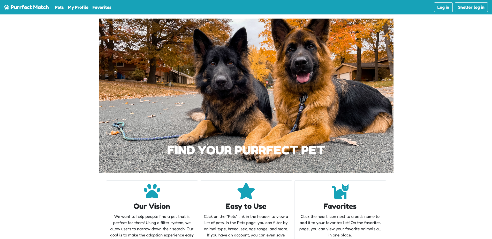

# Purrfect Match
A "dating" app that matches shelter animals up with prospective owners

## Background

This is our capstone project for Oregon State University's Computer Science program. We used React and Bootstrap in the frontend and created a RESTful API using Node/Express in the backend. The database uses MySQL. This project helped solidify our skills in the creation of web applications, allowed us to gain experience using industry techniques and technologies, and gave us a good addition to our portfolios.

## Team Members
- [Eriko Dott](https://github.com/dotte-osu)
- [Esther Lin](https://github.com/asching7108)
- [Xander Houdek](https://github.com/xHoudek)

## Frontend Installation Instructions

### Get Files

- Pull remote into a local directory (or download .zip file and extract)
- In the root folder (the one with `package.json`), run `npm install`

### Configure API

- Follow all installation instructions for [the API](https://github.com/asching7108/purrfect-match-api)
  - Note: API should be installed in a different directory
- From the frontend root folder (non-API), navigate to `/config/hostname.config.js`
- Change the hostname to wherever the API is running. Default is `http://localhost:8000`

### Run

- From the root folder, run `npm start`
  - If you want to use a specific port, run `PORT=[myPort] npm start`
